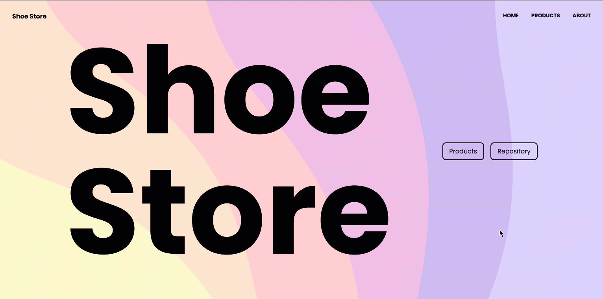

# Shoe Store

## [Live](https://shoe-store-react-router-v6.surge.sh/)


## Introduction
Shoe store app using React Router and TypeScript.

## Setup
```bash
# Clone repository.
git clone https://github.com/saadfrhan/shoe-store-react-router-v6

# Navigate to project folder, and install dependencies.
cd shoe-store-react-router-v6 && npm i

# Start development server.
npm start
```
